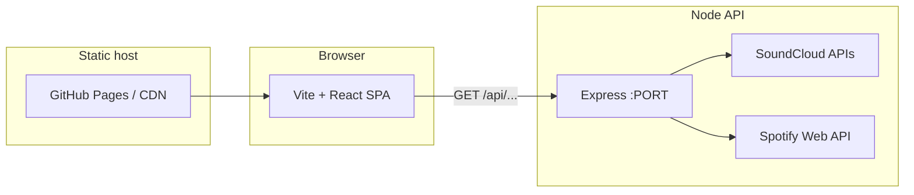

# ViggySounds — Artist EPK (React)

Single-page Linktree-style EPK for upcoming shows, past shows, music links, media, and YouTube. A small **Express API** in `server/` powers optional integrations (Spotify catalog, SoundCloud).

---

## Architecture



| Piece                 | Role                                                                                                           |
| --------------------- | -------------------------------------------------------------------------------------------------------------- |
| **Frontend** (`src/`) | React SPA built with Vite; `dist/` is static HTML/CSS/JS.                                                      |
| **API** (`server/`)   | Express app: proxies Spotify/SoundCloud, handles SoundCloud user OAuth, exposes `/health` and `/api/*`.        |
| **Dev**               | Vite dev server proxies `/api` → `http://localhost:3001` (see `vite.config.js`).                               |
| **Production**        | The static site must know the API origin via **`VITE_API_BASE_URL`** (see [Frontend env](#frontend-env-vite)). |

No database: Spotify uses an in-memory token cache; SoundCloud uses env + optional **JSON token file** on disk (or env-only access token).

---

## Authentication & API flows

### Spotify (server only)

- **Flow:** [Client Credentials](https://developer.spotify.com/documentation/web-api/tutorials/client-credentials-flow) — no user login.
- **Secrets:** `SPOTIFY_CLIENT_ID`, `SPOTIFY_CLIENT_SECRET`.
- **Usage:** Server obtains an access token, caches it in memory, and calls Web API routes such as `/api/spotify/track/:id` and `/api/spotify/search`.

### SoundCloud — two credential layers

1. **App (client credentials)**
   - **Flow:** OAuth 2.1 client credentials against `secure.soundcloud.com/oauth/token`.
   - **Secrets:** `SOUNDCLOUD_CLIENT_ID`, `SOUNDCLOUD_CLIENT_SECRET`.
   - **Usage:** Non-user endpoints, e.g. `/api/soundcloud/tracks/:id`, `/api/soundcloud/resolve`.

2. **User (authorization code + PKCE)**
   - Needed for **`/me`**-style data (e.g. **`/api/soundcloud/top-tracks`**, **`/api/soundcloud/me/tracks`**).
   - **Step 1:** Browser or HTTP client opens **`GET /api/soundcloud/auth/start`** → redirect to SoundCloud authorize.
   - **Step 2:** SoundCloud redirects to **`GET /api/soundcloud/auth/callback?code=&state=`** (must match **`SOUNDCLOUD_REDIRECT_URI`** registered in the SoundCloud app).
   - **PKCE:** `state` is HMAC-signed and embeds the `code_verifier` (10-minute expiry), so load-balanced Machines do not need shared memory.
   - **Persistence:** Tokens are written to **`SOUNDCLOUD_USER_TOKEN_FILE`** (default: `server/.soundcloud-user-tokens.json`, gitignored). Access tokens refresh using the stored refresh token when possible.
   - **Fallback:** `SOUNDCLOUD_USER_ACCESS_TOKEN` can override the access token if you cannot persist a file (you must refresh manually when it expires).

### CORS

- **`CORS_ORIGIN`:** Comma-separated list of browser origins allowed to call the API. Must include your static site origin in production (e.g. `https://youruser.github.io`).

### Health check

- **`GET /health`** — JSON with booleans for Spotify/SoundCloud configuration and the resolved SoundCloud redirect URI (useful when debugging OAuth).

---

## Frontend env (Vite)

Copy `.env.example` to `.env` at the repo root if needed.

| Variable                | Purpose                                                                                                                                                                               |
| ----------------------- | ------------------------------------------------------------------------------------------------------------------------------------------------------------------------------------- |
| **`VITE_API_BASE_URL`** | Full origin of the deployed API, **no trailing slash** (e.g. `https://viggysounds-api.fly.dev`). If unset, the app uses relative **`/api/...`** (works with the Vite dev proxy only). |

---

## Server env

Copy `server/.env.example` to `server/.env`.

| Variable                                                   | Purpose                                                                                                                                                                                                                         |
| ---------------------------------------------------------- | ------------------------------------------------------------------------------------------------------------------------------------------------------------------------------------------------------------------------------- |
| **`PORT`**                                                 | Listen port (default `3001`; Fly sets this automatically).                                                                                                                                                                      |
| **`CORS_ORIGIN`**                                          | Allowed browser origins (comma-separated).                                                                                                                                                                                      |
| **`SPOTIFY_CLIENT_ID`**, **`SPOTIFY_CLIENT_SECRET`**       | Spotify Client Credentials.                                                                                                                                                                                                     |
| **`SOUNDCLOUD_CLIENT_ID`**, **`SOUNDCLOUD_CLIENT_SECRET`** | SoundCloud app + client-credentials API.                                                                                                                                                                                        |
| **`SOUNDCLOUD_REDIRECT_URI`**                              | Must match the redirect URL in the SoundCloud developer app **exactly** (e.g. `https://your-api.fly.dev/api/soundcloud/auth/callback`). If omitted locally, defaults to `http://localhost:<PORT>/api/soundcloud/auth/callback`. |
| **`SOUNDCLOUD_USER_TOKEN_FILE`**                           | Optional absolute path for persisted user OAuth tokens (use a file on a **mounted volume** on Fly so tokens survive restarts).                                                                                                  |
| **`SOUNDCLOUD_USER_ACCESS_TOKEN`**                         | Optional short-term override if you cannot use the token file.                                                                                                                                                                  |

---

## Local dev

**Frontend only**

```bash
npm install
npm run dev
```

**Full stack** (terminal 1: API, terminal 2: Vite)

```bash
cd server && npm install && cp -n .env.example .env
# Edit server/.env — at minimum SoundCloud/Spotify keys if you use those features.

npm run server:dev
# From repo root:
npm run dev
```

Vite proxies `/api` → `http://localhost:3001`.

---

## Build

```bash
npm run build
```

Output: `dist/`.

---

## Customize your content

Edit `src/data/epk.js`:

- `artistName`, `artistTagline`, `socialCta`
- `hero.backgroundImage`
- `upcomingShows` (use `date` as `YYYY-MM-DD` + `href` to your ticket/RSVP link)
- `pastShows`
- `youtubeVideos` (`videoId` only)
- `socials`
- `contact.email`

## Media — show photos (automatic)

Add image files to `public/media/photos/shows/` (`.jpg`, `.png`, `.webp`, etc.). On `npm run dev` or `npm run build`, a small Vite plugin scans that folder and writes `src/generated/showPhotos.json`. The **Media** section reads that list—no manual entries in `epk.js`.

## Customize music (YAML)

Music is stored as YAML and loaded into the site.

- Originals: `src/data/music/originals.yaml`
- Remixes: `src/data/music/remixes.yaml`

Each YAML file has:

- `category`: `original` or `remix`
- `tracks`: an array of tracks with optional `url`, `spotify`, `soundcloud`, and `description`
- `coverArt`: (optional) string path to a local image, e.g. `media/cover-art/my-track.jpg`

---

## Deploy static site (GitHub Pages)

There is a workflow in `.github/workflows/deploy.yml`. It builds and deploys `dist/` to GitHub Pages.

1. Enable GitHub Pages on the repo and connect the workflow.
2. So the SPA can reach your API, add a repository **Actions secret** (or **Variables**) **`VITE_API_BASE_URL`** set to your API origin (e.g. `https://your-app.fly.dev`), and pass it into the **Build** step `env` in the workflow (or build locally with that env before upload).

Example `env` for the workflow build step:

```yaml
env:
  VITE_API_BASE_URL: ${{ secrets.VITE_API_BASE_URL }}
  VITE_BUILD_VERSION: ${{ github.run_number }}
  # ... other VITE_* as you already have
```

---

## Deploy API on Fly.io

These steps assume the [Fly CLI](https://fly.io/docs/hands-on/install-flyctl/) is installed and you are logged in (`fly auth login`). The API lives in **`server/`** and includes a **`Dockerfile`**.

### 1. Create the app

From the **`server/`** directory:

```bash
cd server
fly launch --no-deploy
```

- Choose an app name and region.
- When asked for a Dockerfile, confirm use of the existing **`Dockerfile`**.

If you prefer to configure by hand, ensure HTTP service **`internal_port`** matches what the app listens on (**`3001`** in this repo, or whatever **`PORT`** Fly injects — the code uses `process.env.PORT`).

### 2. Persistent token storage (recommended)

Fly Machines have an **ephemeral filesystem**. Without a volume, `SOUNDCLOUD_USER_TOKEN_FILE` would be lost on restart and user OAuth would need repeating.

Create a small volume (once per app, pick your region):

```bash
fly volumes create soundcloud_tokens --region <your-region> --size 1
```

In `fly.toml`, add a mount (Fly docs: [Volumes](https://fly.io/docs/reference/configuration/#the-mounts-section)):

```toml
[mounts]
  source = "soundcloud_tokens"
  destination = "/data"
```

This repo’s `server/fly.toml` sets **`[env] SOUNDCLOUD_USER_TOKEN_FILE=/data/soundcloud-user-tokens.json`** so tokens land on the volume. You can override with `fly secrets set` if needed.

**Volume shows as unattached:** Fly often runs **two Machines** (HA) while you created **one** volume. A volume mounts to **one Machine** only. Either create **another volume** in the **same region** with the same name (`fly volumes create soundcloud_tokens -r dfw --size 1`), or run a **single Machine**:

```bash
fly scale count 1
fly deploy
```

Check **`fly machines list`** and **`fly volumes list`** — volume **region** must match **`primary_region`** in `fly.toml` and the region you used in `fly volumes create`.

### 3. Secrets and env

Set API keys and CORS (replace values):

```bash
fly secrets set \
  SPOTIFY_CLIENT_ID=... \
  SPOTIFY_CLIENT_SECRET=... \
  SOUNDCLOUD_CLIENT_ID=... \
  SOUNDCLOUD_CLIENT_SECRET=... \
  CORS_ORIGIN=https://youruser.github.io,https://www.yourdomain.com
```

Set the **SoundCloud redirect URI** to match your Fly app **and** the SoundCloud developer dashboard:

```bash
fly secrets set SOUNDCLOUD_REDIRECT_URI=https://<your-app>.fly.dev/api/soundcloud/auth/callback
```

In the [SoundCloud app settings](https://developers.soundcloud.com/), register the **same** redirect URL.

### 4. Connect SoundCloud (one-time)

After deploy, open in a browser (while logged into the SoundCloud account you want):

`https://<your-app>.fly.dev/api/soundcloud/auth/start`

Complete the redirect; the callback stores tokens on the volume (if configured). Check **`GET /health`** for `soundcloudUser: true`.

### 5. Point the frontend at the API

Set **`VITE_API_BASE_URL`** to `https://<your-app>.fly.dev` when building the static site, then redeploy GitHub Pages (or your host).

### 6. Deploy

```bash
cd server
fly deploy
```

Deploy again after scaling. For HA with multiple Machines, provision **one volume per Machine** in that region (same volume name is allowed per Fly’s model—see `fly volumes create` docs).

---

## Deploy to GitHub Pages (summary)

Push to `main` / `master` and let `.github/workflows/deploy.yml` run, after you have configured Pages and (if needed) **`VITE_API_BASE_URL`** for the build.
